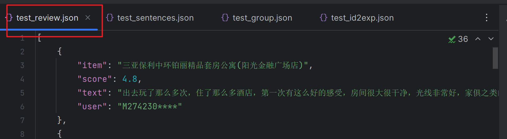
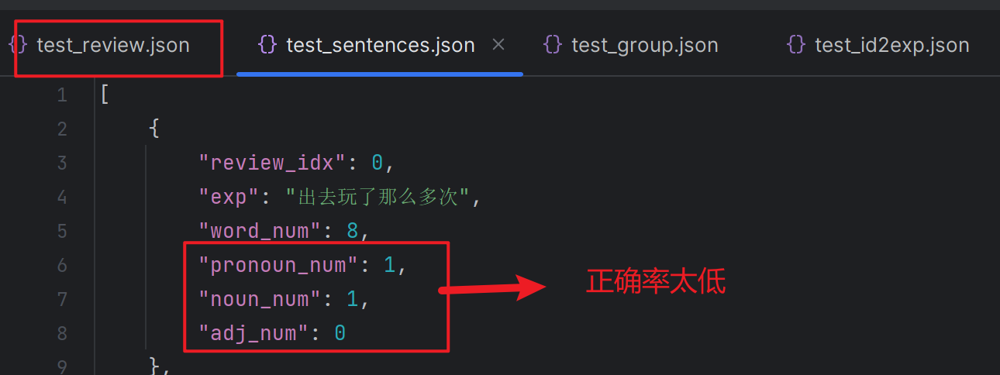
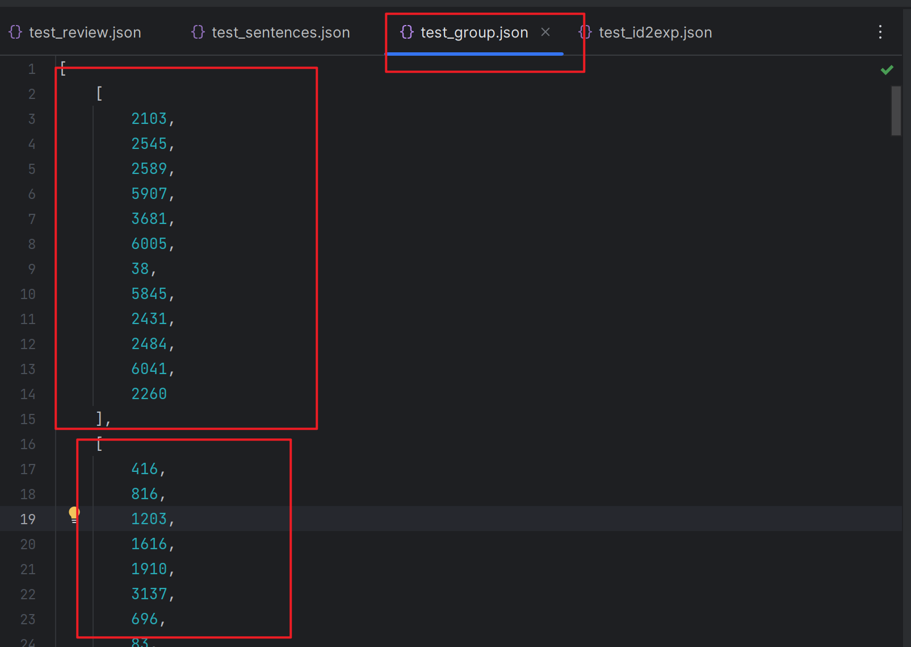
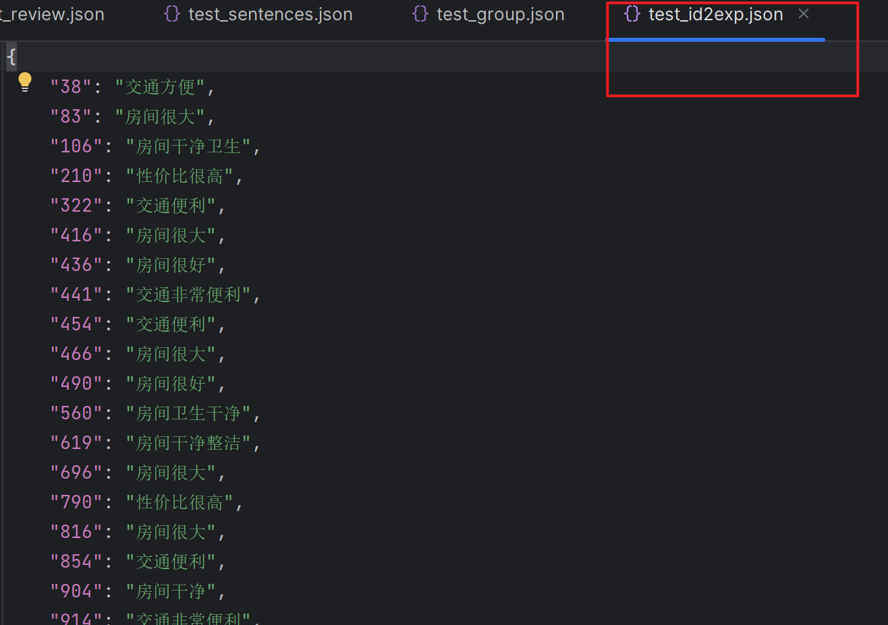

# Data_Processing

## 使用方法

已安装jieba库，nltk库，pickle库

中英文的运行方式一样

1. 运行format_amazon.py

   生成test_review.json

2. 运行process_sentence.py

   生成test_sentences.json

3. 运行group_sentence.py

   生成test_group.json

4. 运行keep_valid.py

   生成test_id2exp.py

**Note：**

源代码使用pickle格式，但是不可视化。我又将数据存入一份到json文件中，可以看到具体数据

源数据太大了。我分别截取了1000条进行测试


## 具体实现

1. format_amazon.py主要是将源数据中的键提取出来。

   

2. process_sentence.py主要是提取每一个分句。方法是将所有符号转换成句号，再依据句号分割。然后计算出分句的字数，人称代词，名词，形容词的个数。

   **Note：**

   **这里的问题是，原文用的nltk库，但是对简体中文不太适用，我改用jieba库进行词性标记，但是错误比较多。**

   

3. group_sentence.py是最重要的，用来计算句子相似性并分组。

   首先将一个一个词分开。英文可以用空格分开，中文我是用jieba分词库去分。

   **Note：**

   **但是实际上这里就完成了分词的任务**

   **但是没有去停用词，这里需要吗？**

   然后构造k_shingles。

   ```
   这里是原文规定好的属性
   sim_thresholds = [0.9]  # the similarity between two near duplicates. To test more in this way [0.9, 0.85, 0.7] 两个接近重复项之间的相似度
   shingle_size = 2  # preserve the word order to some extent
   group_size = 5  # minimum number of sentences in a
   ```

   为满足词数小于shingle_size，不含有人称代词，名词和形容词的数量大于等于1的句子创建MinHash对象

   然后利用datasketch库的MinHash, LeanMinHash, MinHashLSH类进行句子分组。

   我们得到有相似句子的索引

   

4. keep_valid.py主要是将上一步的索引和解释对应起来。

   


